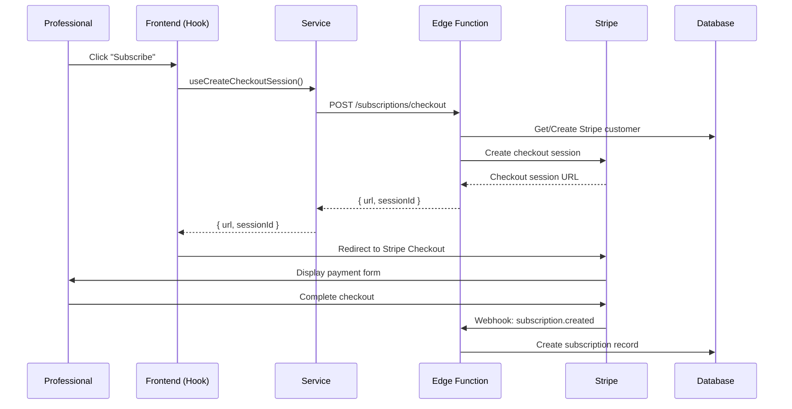
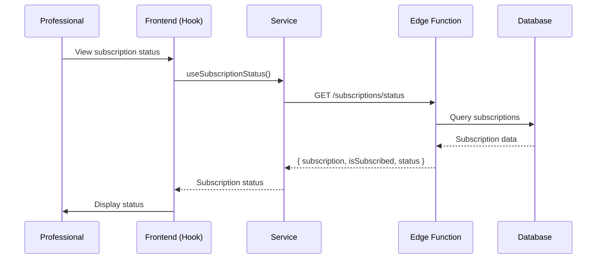
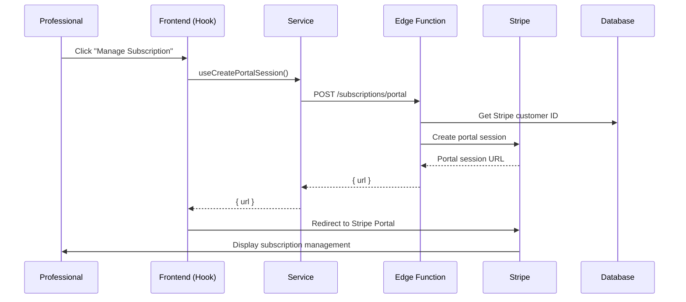
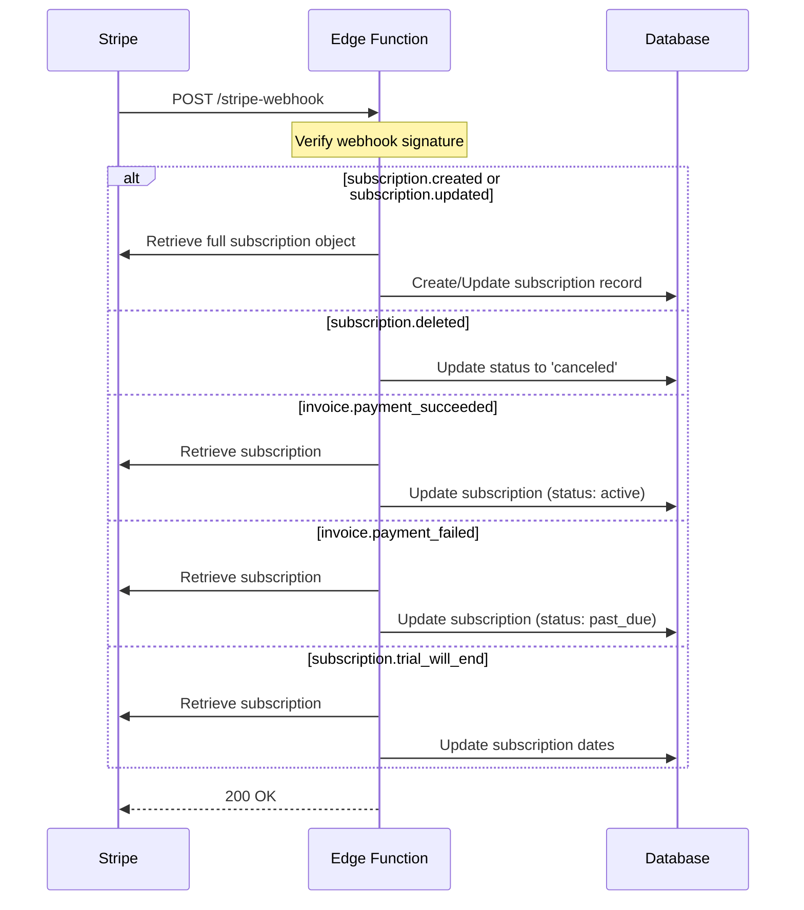

# Professional Subscription System Documentation

## Overview

The professional subscription system enables professionals to subscribe monthly to access the application. The system uses Stripe Subscriptions API with a 3-month free trial period. The subscription is priced at €9.99 per month.

## Architecture

```
┌─────────────┐
│  Frontend   │
│  (Next.js)  │
│  Hooks &    │
│  Services   │
└──────┬──────┘
       │
       │ Edge Function Calls
       │ (via invokeEdgeFunction)
       ▼
┌──────────────────────────┐
│  Supabase Edge Functions │
│  - subscriptions         │
│  - stripe-webhook        │
└──────┬───────────────────┘
       │
       │ Stripe API
       ▼
┌─────────────┐
│   Stripe    │
└──────┬──────┘
       │
       │ Webhooks
       ▼
┌──────────────────────────┐
│  stripe-webhook Function  │
└──────┬───────────────────┘
       │
       │ Database Updates
       ▼
┌──────────────────────────┐
│     Supabase Database    │
│  subscriptions           │
└──────────────────────────┘
```

## Database Schema

### `subscriptions` Table

Tracks subscription status for each professional:

- `id` - UUID primary key
- `professional_id` - Reference to professionals table (user_id)
- `stripe_subscription_id` - Unique Stripe subscription ID
- `stripe_price_id` - Stripe price ID for the subscription
- `status` - Current status using `subscription_status` enum type (active, trialing, past_due, canceled, etc.)
- `current_period_start` - Start of current billing period
- `current_period_end` - End of current billing period
- `trial_start` - Start of trial period
- `trial_end` - End of trial period
- `cancel_at_period_end` - Whether subscription will cancel at period end
- `canceled_at` - Timestamp when subscription was canceled
- `created_at` - Record creation timestamp
- `updated_at` - Record update timestamp

### Helper Function

`is_professional_subscribed(user_id UUID)` - Returns `true` if professional has an active or trialing subscription.

## User Flow

### 1. Subscription Checkout Flow



**Steps:**

1. Professional clicks "Subscribe" button in the frontend
2. Frontend uses `useCreateCheckoutSession()` hook with `successUrl` and `cancelUrl`
3. Hook calls service which invokes Supabase Edge Function
4. Edge Function:
   - Authenticates the user
   - Verifies user is a professional
   - Gets or creates Stripe customer ID
   - Creates Stripe checkout session with:
     - Price: €9.99/month
     - Trial period: 90 days (3 months)
     - Success/cancel URLs
     - Metadata with user_id
5. Returns checkout session URL to frontend
6. Frontend redirects user to Stripe Checkout
7. User completes checkout on Stripe
8. Stripe sends webhook event `customer.subscription.created`
9. Webhook handler creates subscription record in database

### 2. Subscription Status Check Flow



**Steps:**

1. Frontend uses `useSubscriptionStatus()` hook
2. Hook calls service which invokes Supabase Edge Function
3. Edge Function:
   - Authenticates the user
   - Verifies user is a professional
   - Queries `subscriptions` table
4. Returns subscription status, including:
   - Full subscription object
   - `isSubscribed` boolean (true if active or trialing)
   - Current status

### 3. Customer Portal Flow



**Steps:**

1. Professional clicks "Manage Subscription"
2. Frontend uses `useCreatePortalSession()` hook with `returnUrl`
3. Hook calls service which invokes Edge Function
4. Edge Function:
   - Authenticates the user
   - Verifies user is a professional
   - Gets Stripe customer ID from database
   - Creates Stripe billing portal session
4. Returns portal session URL
5. Frontend redirects user to Stripe Customer Portal
6. User can manage subscription, update payment method, view invoices, etc.

### 4. Webhook Event Flow



**Handled Events:**

- `customer.subscription.created` - New subscription created
- `customer.subscription.updated` - Subscription updated (status change, period change, etc.)
- `customer.subscription.deleted` - Subscription canceled
- `invoice.payment_succeeded` - Payment successful, subscription active
- `invoice.payment_failed` - Payment failed, subscription past_due
- `customer.subscription.trial_will_end` - Trial ending soon

**Webhook Security:**

- Webhook signature verification using `STRIPE_WEBHOOK_SECRET`
- Only verified webhooks are processed
- Webhook endpoint does not require JWT authentication (uses signature verification instead)

## Frontend Integration

### React Hooks

The subscription system uses React Query hooks for data fetching and mutations:

#### `useCreateCheckoutSession()`

Creates a Stripe checkout session for subscription.

**Usage:**
```typescript
import { useCreateCheckoutSession } from '@/features/subscriptions/hooks';

const { mutate: createCheckout } = useCreateCheckoutSession();

createCheckout({
  successUrl: 'https://yourapp.com/subscription/success',
  cancelUrl: 'https://yourapp.com/subscription/cancel'
}, {
  onSuccess: (data) => {
    window.location.href = data.url;
  }
});
```

**Response:**
```typescript
{
  url: string;
  sessionId: string;
}
```

#### `useSubscriptionStatus()`

Gets current subscription status for authenticated professional.

**Usage:**
```typescript
import { useSubscriptionStatus } from '@/features/subscriptions/hooks';

const { data, isLoading } = useSubscriptionStatus();
```

**Response:**
```typescript
{
  subscription: ProfessionalSubscription | null;
  isSubscribed: boolean;
  status: SubscriptionStatus | null;
}
```

#### `useCreatePortalSession()`

Creates Stripe customer portal session.

**Usage:**
```typescript
import { useCreatePortalSession } from '@/features/subscriptions/hooks';

const { mutate: createPortal } = useCreatePortalSession();

createPortal({
  returnUrl: 'https://yourapp.com/subscription'
}, {
  onSuccess: (data) => {
    window.location.href = data.url;
  }
});
```

**Response:**
```typescript
{
  url: string;
}
```

### Services

Services are located in `features/subscriptions/subscription.service.ts` and handle direct communication with Edge Functions:

- `createCheckoutSession()` - Creates checkout session
- `getSubscriptionStatus()` - Gets subscription status
- `createPortalSession()` - Creates portal session

### Supabase Edge Functions

#### `POST /subscriptions/checkout`

Internal endpoint called by Next.js API. Requires authentication.

#### `GET /subscriptions/status`

Internal endpoint called by Next.js API. Requires authentication.

#### `POST /subscriptions/portal`

Internal endpoint called by Next.js API. Requires authentication.

#### `POST /stripe-webhook`

Webhook endpoint for Stripe events. No authentication required (uses signature verification).

## Subscription Statuses

The system tracks the following subscription statuses using the `subscription_status` enum type (matching Stripe):

- `active` - Subscription is active and paid
- `trialing` - Subscription is in trial period
- `past_due` - Payment failed, subscription is past due
- `canceled` - Subscription has been canceled
- `unpaid` - Subscription is unpaid
- `incomplete` - Subscription setup incomplete
- `incomplete_expired` - Subscription setup expired
- `paused` - Subscription is paused

### Status Labels

Status labels are available in both English and French via `SubscriptionStatusLabel`:

```typescript
import { SubscriptionStatusLabel, SubscriptionStatus } from '@/features/subscriptions/subscription.model';

// English
const labelEn = SubscriptionStatusLabel.en[SubscriptionStatus.active]; // "Active"

// French
const labelFr = SubscriptionStatusLabel.fr[SubscriptionStatus.active]; // "Actif"
```

## Trial Period

- **Duration:** 90 days (3 months)
- **Start:** When subscription is created via Stripe Checkout
- **End:** Automatically transitions to active status after 90 days
- **Billing:** No charge during trial, billing starts after trial ends

## Access Control

The `is_professional_subscribed()` function can be used in:

1. **RLS Policies** - Restrict access to features based on subscription status
2. **Application Logic** - Check subscription before allowing actions
3. **Frontend** - Display subscription status and gate features

Example RLS policy:
```sql
CREATE POLICY "Professionals with active subscription can access features"
ON "public"."some_table"
FOR SELECT
TO authenticated
USING (
  EXISTS (
    SELECT 1 FROM public.subscriptions
    WHERE professional_id = (SELECT auth.uid())
    AND status IN ('active', 'trialing')
  )
);
```

## Environment Variables

Required environment variables in Supabase:

- `STRIPE_SECRET_KEY` - Stripe secret key (already configured)
- `STRIPE_WEBHOOK_SECRET` - Webhook signing secret from Stripe dashboard
- `STRIPE_PRICE_ID` - Stripe Price ID for €9.99/month subscription

## Configuration

Subscription configuration is defined in `subscription.config.ts`:

- `TRIAL_PERIOD_DAYS: 90` - 3 months trial
- `SUBSCRIPTION_AMOUNT_CENTS: 999` - €9.99 in cents
- `SUBSCRIPTION_CURRENCY: 'eur'` - Euro currency
- `SUBSCRIPTION_INTERVAL: 'month'` - Monthly billing

## Error Handling

All endpoints handle errors gracefully:

- **Authentication errors** - Returns 401 Unauthorized
- **Authorization errors** - Returns 403 Forbidden (non-professionals)
- **Validation errors** - Returns 400 Bad Request
- **Stripe errors** - Returns 500 with error message
- **Database errors** - Returns 500 with error message

## Testing

To test the subscription system:

1. **Local Development:**
   - Use Stripe test mode
   - Use test cards (4242 4242 4242 4242)
   - Configure webhook endpoint in Stripe dashboard

2. **Webhook Testing:**
   - Use Stripe CLI: `stripe listen --forward-to localhost:54321/functions/v1/stripe-webhook`
   - Trigger test events: `stripe trigger customer.subscription.created`

3. **Subscription Flow:**
   - Use `useCreateCheckoutSession()` hook to create checkout session
   - Complete checkout with test card
   - Verify webhook creates subscription record
   - Use `useSubscriptionStatus()` hook to check subscription status

## Security Considerations

1. **Webhook Verification** - All webhooks are verified using Stripe signature
2. **Authentication** - All subscription endpoints require authentication
3. **Authorization** - Only professionals can access subscription features
4. **RLS Policies** - Database enforces access control at row level
5. **Service Role** - Webhook handler uses service role to bypass RLS for updates

## Future Enhancements

Potential improvements:

- Email notifications for subscription events
- Subscription upgrade/downgrade functionality
- Prorated billing for mid-cycle changes
- Subscription analytics dashboard
- Automated retry for failed payments
- Grace period for past_due subscriptions
